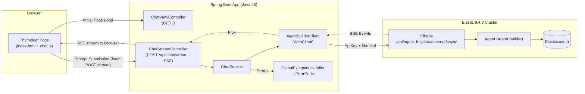
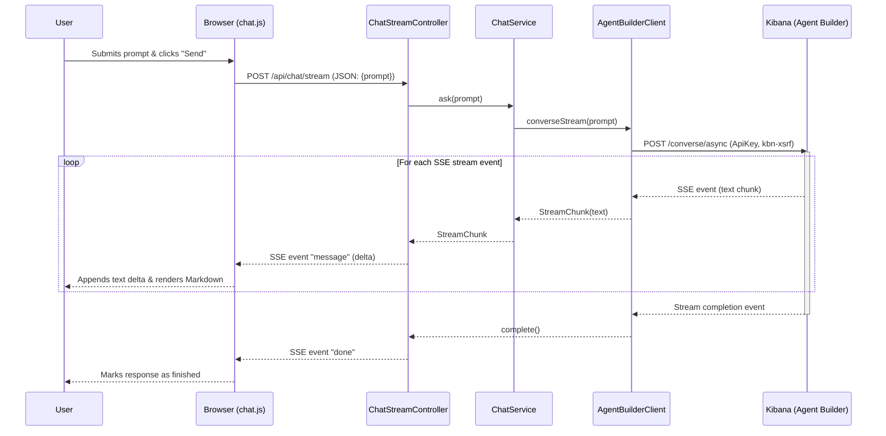

# Web Chatbot with Elastic Agent Builder

A web application that sends a prompt to an **Elastic Agent Builder** agent (**Elastic 9.4.3**) and displays the response **live** (SSE streaming) in the browser. Each interaction is independent: **there is no conversational memory**.

The application acts as a **streaming proxy** between the browser and Kibana. The API Key lives exclusively in the backend and **never** reaches the client/browser.

> 💡 **Key Technical Note:** The endpoint for conversing with an agent resides in **Kibana** (`/api/agent_builder/converse/async`), NOT on the Elasticsearch node (`:9200`). Therefore, `KIBANA_BASE_URL` must point to Kibana.

---

## Technical Stack

- **Java 25 (LTS)** · **Spring Boot 4.1.0** · **Maven**
- **Thymeleaf** for server-side HTML rendering + JavaScript (`fetch` + `ReadableStream`) to parse the live SSE stream.
- **Spring WebFlux `WebClient`** to consume Kibana's SSE stream (the application continues to run on Tomcat/servlet stack).
- **Jackson 3** (`tools.jackson.*`) for JSON handling — bundled with Spring Boot 4 (new package namespace; annotations remain under `com.fasterxml.jackson.annotation`).
- **marked** + **DOMPurify** (vendorized locally) to securely render Markdown in the browser without external CDNs.
- **Java 25 Virtual Threads** enabled (`spring.threads.virtual.enabled=true`).

---

## Architecture & Communication Flow

### System Architecture



### Streaming Sequence Diagram



---

## Prerequisites

**On the Elastic Side (provided by your administrator):**

- **Elastic 9.4.3** cluster with **Agent Builder enabled** (GA as of version 9.4).
- An agent created in Agent Builder; you need its **`agent_id`** (default: `demo-seguros-siem`).
- **Kibana URL** accessible from where the application runs.
- **Kibana API Key** with Agent Builder permissions.
- Kibana **Space** name if the agent is not located in the default Space.

**On the Development Side:**

- JDK 25 and Apache Maven.

---

## Configuration

Configuration resides in `src/main/resources/application.yml`. All properties come with pre-configured **default values**, allowing the app to start out of the box without requiring environment variables. Any environment variable defined will **override** the defaults:

| Environment Variable | Description |
|----------------------|-------------|
| `KIBANA_BASE_URL`    | Base URL of **Kibana**. Defaults to the project cluster URL. |
| `ELASTIC_API_KEY`    | Kibana API Key with Agent Builder privileges. |
| `ELASTIC_AGENT_ID`   | Target `agent_id` (defaults to `demo-seguros-siem`). |
| `ELASTIC_SPACE`      | Kibana Space name (empty = default Space). |

Current defaults in `application.yml`:

- `kibana-base-url`: `https://bigfito-serverless-security-ebcf18.kb.us-central1.gcp.elastic.cloud`
- `agent-id`: `demo-seguros-siem`
- `api-key`: included in the configuration file for demo convenience (see security warning below).

> ⚠️ **Security Warning:** The API Key is committed in `application.yml`. **Do not push this file with sensitive keys to public repositories**, and **rotate key credentials** if exposed. For production or staging deployments, omit the key from `application.yml` and inject it exclusively via environment variable:
>
> ```bash
> export ELASTIC_API_KEY="<your_kibana_api_key>"
> ```

---

## How to Run

### Development Mode

```bash
# 1) Optionally export custom environment variables (see above)
# 2) Run the application
mvn spring-boot:run
```

Open your browser at <http://localhost:8080>, enter a query in the prompt area, and press **Send** (or shortcut `Ctrl`/`Cmd` + `Enter`).

### Packaging & Executable JAR

```bash
mvn clean package
java -jar target/agent-chat-0.0.1.jar
```

---

## User Interface & Features

The user interface (`/`) is a single-screen responsive chat application with a soft **pastel light theme**:

- **Conversation History Area** (Pastel Blue): Displays dialogue turns formatted in visually distinct role bubbles:
  - **User**: The prompt submitted by the user, right-aligned (pastel lilac background). Rendered strictly as plain text for security.
  - **Agent**: The generated response, left-aligned (white card), rendered dynamically in **Markdown** as tokens stream in, accompanied by a flickering cursor indicator.
- **Input Area** (Pastel Pink): Contains the `textarea` prompt box and action buttons.

### Interactive Behaviors

- **Send**: Submits the user prompt. Keyboard shortcut: `Ctrl` / `Cmd` + `Enter`.
- **Auto-Clearing Prompt**: Upon a **successful** response, the prompt `textarea` is automatically cleared. If an error occurs, the input text is **retained** to allow instant retries.
- **Reset Button** (located left of *Send*): Resets client-side chat state from scratch — aborts any active streaming request (`AbortController`), clears dialogue history and text input, and returns the UI to its initial state. It prompts for **user confirmation** if unsaved content exists. Reset is strictly client-side and does not reload the page or affect backend state (the backend is stateless).

> 📌 **Visual-Only History Note:** The app does **not** maintain server-side or LLM conversational memory. Dialogue history rendered on screen is purely visual for UX clarity; each prompt is processed independently by the backend.

---

## Testing Kibana Connectivity with `curl` (Optional)

To verify network connectivity and API Key permissions directly against Kibana:

### Synchronous Endpoint

```bash
curl -X POST "https://bigfito-serverless-security-ebcf18.kb.us-central1.gcp.elastic.cloud/api/agent_builder/converse" \
     -H "Authorization: ApiKey ${ELASTIC_API_KEY}" \
     -H "kbn-xsrf: true" \
     -H "Content-Type: application/json" \
     -d '{ "input": "What is Elasticsearch?", "agent_id": "demo-seguros-siem" }'
```

### Asynchronous Streaming Endpoint

For SSE streaming, target `/api/agent_builder/converse/async` (prefixed with `/s/<space>` if utilizing a non-default Kibana Space).

---

## Project Structure

```
src/main/java/com/bigfito/agentchat/
├── AgentChatApplication.java          # Spring Boot main class
├── config/
│   ├── ElasticAgentProperties.java    # Configuration properties for Kibana connection
│   └── WebClientConfig.java           # WebClient bean configuration
├── web/
│   ├── ChatViewController.java        # Serves GET / (Thymeleaf UI)
│   └── ChatStreamController.java      # Serves POST /api/chat/stream (SSE endpoint)
├── service/
│   └── ChatService.java               # Validation and stream orchestration logic
├── client/
│   ├── AgentBuilderClient.java        # Interface boundary gateway
│   └── AgentBuilderWebClient.java     # WebClient implementation consuming Kibana SSE
├── model/
│   ├── PromptRequest.java             # DTO for user prompt input
│   ├── ConverseRequest.java           # DTO sent upstream to Kibana
│   └── StreamChunk.java               # Normalized SSE output fragment DTO
└── exception/
    ├── ErrorCode.java                 # Standardized error code enum
    ├── AgentBuilderException.java     # Base exception hierarchy
    └── GlobalExceptionHandler.java    # @ControllerAdvice mapping errors to SSE or HTTP

src/main/resources/
├── application.yml                    # Application settings and default credentials
├── templates/
│   └── index.html                     # Main chat UI template (Thymeleaf)
└── static/
    ├── css/chat.css                   # Pastel design system and bubble layout styles
    └── js/
        ├── chat.js                    # SSE stream processing, UI rendering, reset logic
        └── vendor/                    # Local vendor libraries (no CDN dependencies)
            ├── marked.min.js          # Markdown parser
            └── purify.min.js          # DOMPurify XSS sanitizer
```

---

## Error Handling

Application errors are mapped to user-actionable `ErrorCode` enums:

| Error Code | Trigger Condition | Recommended User Action |
|------------|-------------------|-------------------------|
| `PROMPT_EMPTY` | Prompt input is empty or blank | Provide a non-empty question |
| `PROMPT_TOO_LONG` | Prompt exceeds 4,000 characters | Shorten prompt text |
| `AUTH_INVALID` | Invalid or expired API Key (401) | Regenerate API Key in Kibana |
| `FORBIDDEN` | Missing Agent Builder permissions (403) | Update role privileges in Kibana |
| `AGENT_NOT_FOUND` | Agent ID does not exist (404) | Verify `agent_id` configuration |
| `UPSTREAM_ERROR` | Elastic/Kibana server error (5xx) | Retry or notify infrastructure ops |
| `TIMEOUT` | Agent request timed out | Retry; review `response-timeout` setting |

- Errors occurring **prior** to opening the SSE stream return a structured HTTP error response.
- Errors occurring **mid-stream** trigger an SSE `error` event containing `{code, message}`.

---

## Automated Testing

Execute the test suite using Maven:

```bash
mvn test
```

The test suite covers **11 unit and integration tests**:

- `ChatServiceTest`: Validates prompt constraints (empty or oversized inputs).
- `AgentBuilderWebClientTest`: Simulates Kibana's real SSE stream using **MockWebServer** (verifying event line parsing `event: message` and JSON payload `data.text_chunk`), as well as mapping 401/403/5xx HTTP codes to custom exception types.
- `ChatStreamControllerTest`: Verifies full SSE stream emission sequences (`message` events followed by `done` signal) and exception-to-error-event translations.

---

## Design Decisions & Technical Notes

1. **No Conversational Memory:** No `conversation_id` is passed to Kibana. UI dialogue history is maintained strictly on the client side. To enable multi-turn memory in future iterations, capture the `conversation_id` returned by Kibana's stream and pass it within `ConverseRequest`.
2. **Client-Side Reset:** The *Reset* button triggers an `AbortController.abort()` to terminate in-flight HTTP requests cleanly, clears conversation DOM nodes, and restores control states without refreshing the browser or touching the backend server.
3. **Resilient SSE Parser:** Kibana 9.4.x streams specify event types in the SSE **`event:` header line** (rather than a JSON field), while text payloads reside in `data.text_chunk`. The parser filters for visible text events (`message_chunk`) and safely ignores unknown event types without breaking.
4. **Secure Markdown Rendering:** Streamed agent markdown is parsed client-side using [`marked`](https://marked.js.org) and sanitized via [`DOMPurify`](https://github.com/cure53/DOMPurify) before DOM injection, mitigating XSS risks. All assets are self-hosted under `static/js/vendor/`.
5. **App Security Guidelines:** Designed primarily for internal sandbox/demo applications. For public deployment, integrate `spring-boot-starter-security` (authentication + CSRF token propagation via `chat.js` request headers) and IP-based rate limiting.
6. **Reverse Proxies (Nginx, etc.):** Disable response buffering on proxy layers to allow live SSE streaming (e.g., `proxy_buffering off;`).

---

## Related Documents

- Spanish README: [README.md](README.md)
